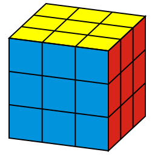
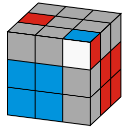
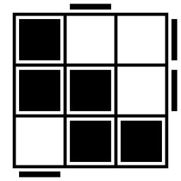
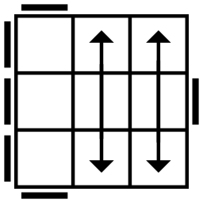
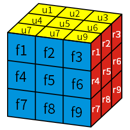

# rubik-image
 
## What is it for?

This tool generates SVG images of Rubik's cube, by which the states of the cube and the algorithm are illustrated. The images are as follows.

    <table>
        <tr>
            <td>
                
            </td>
            <td>
                
            </td>
            <td>
                
            </td>
            <td>
                
            </td>
        </tr>
        <tr>
            <td>
                Rubik's Cube
            </td>
            <td>
                F2L 25
            </td>
            <td>
                OLL 36
            </td>
            <td>
                PLL 09
            </td>
        </tr>
    </table>

Images of CFOP algorithms are covered. Based on [GAN's CFOP](https://www.gancube.com/3x3x3-cfop-guide-of-gancube).

## Why is it?

I need to kill the time during winter vacation at home.

OK. Sure you can use those pictures already there instead of 'generate' an SVG by this tool, but that's not so fun. We want more extensibility and freedom.

## How do I use it?

The docstrings and a few trials of it will guide you, but I believe you gonna need the main ideas here. 

`f2l()`, `oll()` and `pll()` are the main functions. They all would take an algorithm code number as the first paramater, and then generates the corresponding image.

But things can be some more intriguing.

### F2L

For `f2l(x, basestate='slot', filename='f2l.svg')`, `x` can be the numeric code or a dictionary, which tells the script what colour should each patch be filled with. The patches are represented by 2-character string, and on the 'u' (up) face, they are from `u1` to `u9`. The same goes for 'f' and 'r' face.

Each colour are represented by a character. `'w'` for white, `'r'` for red, `'b'` for blue ,`'g'` for green ,`'o'` for orange ,`'y'` for yellow , `'u'` for *gray*.

Therefore, as a dictionary, `x` has patch codes as its keys and colour codes as its values. For example, it can be `{'u4':'r', 'u9':'b', 'f3':'w', 'r1':'r', }`.

`basestate` is the default state of the cube that comes into play when `x` do not cover all 27 patches. It can be `'u'` (all gray), `'w'` (all white), `'cross'` (cross solved), `'f2l'` (F2L finished), `'oll'` (OLL solved), `'complete'` (cube solved) or `'slot'` (F2L except RF slot solved).

`filename` is the file name of the output. Has to be an SVG file. Same below.

### OLL

For `oll(x, rotate=0, filename="oll.svg")`, `x` can also be a 9-character string, specifying the orientation of the top layer pieces. These characters can be `'u'`, `'l'`, `'r'`, `'f'` or `'b'`. For example, `'ubulurufu'` means that the piece 1 faces upwards, and the piece 2 faces backwards and so on. What does 'piece n' mean? If you have read the `F2L` section above, you already got the idea.

Actually there is another way to give you more freedom. In this case, `x` is a list, containing some 3-letter strings, each represents a 'colour patch'. In regex, basically it would be `[lmr][bsf][ulrbf]`. Here the first two letters is the piece and the 3rd letter is the direction the piece faces to. For example, `['lbl', 'lbb']` says that the LB corner faces leftwards and backwards. What does that mean? Though it cannot happen, the two patches that LB faces 'l' and 'b' are both on.

`rotation` is the angle by which the image should rotate clockwise in degrees. It should be -270, -180, -90, 0, 90, 180 or 270. Same below.

### PLL

For `pll(x, rotate=0, filename="pll.svg")`, it is much simpler. `x` can be only the numeric code. Because it can be quite complicated to add those low-level mechanisms and it's not necessary.

### Colours

`utils_geometry_colour.py` module is responsible for that.

Change the colour scheme by `ColourScheme.config_colour()`.

Change the colours by changing the codes in `COLOURS`.

### Size of the image

What?

### And...

Happy cubing and happy hacking!

## Dependencies

Python 3. And maybe some basic knowledges about the cube (for example the notation of moves).

## Contributing

I want to cover more algorithm sets. Contrubutions are always welcome! Open an issue if you have new ideas.